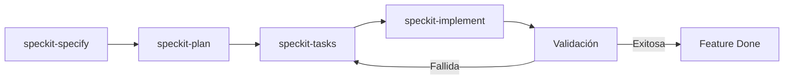

# Speckit — Integración en MapFI

> [!info] Metadata
> **Fecha de integración**: 2026-07-17  
> **Versión Speckit**: `0.12.19.dev0`  
> **Integración**: Claude (opencode)  
> **Estado**: Feature `001-fix-guia-tecnica` completada (2026-07-21)

---

## 1. Qué es Speckit

Speckit es un framework de **Specification-Driven Development (SDD)** que estructura el ciclo de vida de una feature en fases documentadas:

```
Especificación → Planificación → Tareas → Implementación → Validación
```

Cada fase produce artefactos Markdown verificables que sirven como contrato entre el equipo y el código.

---

## 2. Arquitectura de archivos instalados

### 2.1 Configuración central

| Archivo | Propósito |
|---------|-----------|
| `.specify/feature.json` | Apunta al directorio de la feature activa (`specs/001-fix-guia-tecnica`) |
| `.specify/init-options.json` | Opciones de inicialización (AI: claude, integración: claude, script: ps) |
| `.specify/integration.json` | Estado de integraciones instaladas |
| `.specify/integrations/claude.manifest.json` | Manifest de las 10 skills de Claude con hashes SHA-256 |
| `.specify/integrations/speckit.manifest.json` | Manifest de scripts PowerShell y templates |
| `.specify/workflows/workflow-registry.json` | Registro de workflows (Full SDD Cycle v1.0.0) |
| `.specify/workflows/speckit/workflow.yml` | Definición del workflow SDD completo |

### 2.2 Templates

| Template | Uso |
|----------|-----|
| `spec-template.md` | Plantilla para especificaciones de feature |
| `plan-template.md` | Plantilla para planes de implementación |
| `tasks-template.md` | Plantilla para desglose de tareas |
| `checklist-template.md` | Plantilla para checklists de calidad |
| `constitution-template.md` | Plantilla para constitución del proyecto |

### 2.3 Scripts (PowerShell)

| Script | Función |
|--------|---------|
| `check-prerequisites.ps1` | Verifica prerrequisitos y estructura del proyecto |
| `common.ps1` | Funciones compartidas |
| `create-new-feature.ps1` | Crea directorio y archivos iniciales de una feature |
| `setup-plan.ps1` | Inicializa `plan.md` y artefactos de fase 1 |
| `setup-tasks.ps1` | Genera `tasks.md` desde el plan |

### 2.4 Skills de Claude (`.claude/skills/`)

| Skill | Descripción |
|-------|-------------|
| `speckit-specify` | Crea o actualiza la especificación de la feature |
| `speckit-plan` | Ejecuta el workflow de planificación para generar artefactos de diseño |
| `speckit-tasks` | Genera `tasks.md` con tareas accionables y ordenadas por dependencias |
| `speckit-implement` | Ejecuta el plan de implementación procesando todas las tareas |
| `speckit-analyze` | Análisis de consistencia y calidad cruzada entre spec, plan y tasks |
| `speckit-checklist` | Genera checklists personalizados basados en requisitos del usuario |
| `speckit-clarify` | Identifica áreas subespecificadas y formula preguntas de clarificación |
| `speckit-constitution` | Crea o actualiza la constitución del proyecto |
| `speckit-converge` | Evalúa el codebase contra spec/plan/tasks y genera tareas faltantes |
| `speckit-taskstoissues` | Convierte tareas en issues de GitHub accionables |

### 2.5 Constitución del proyecto

**Archivo**: `.specify/memory/constitution.md`  
**Versión**: 1.0.0 | **Ratificada**: 2026-07-20

#### 6 Principios Fundamentales

| # | Principio | Resumen |
|---|-----------|---------|
| I | Simplicidad sin build (Vanilla-First) | HTML/CSS/JS vanilla, sin bundler ni framework de UI |
| II | Arquitectura por capas | Rutas → DAO → Servicios puros, navegador sin acceso a BD |
| III | Seguridad por defecto (NO NEGOCIABLE) | bcrypt, SQL parametrizado, CSP, rate limiting, usuario no-root |
| IV | Calidad verificada | Tests Jest, pg-mem para DAOs, supertest para rutas, ≥70% cobertura |
| V | Migraciones aditivas versionadas | `db/migrations/NNN_*.sql`, nunca editar una ya aplicada |
| VI | Experiencia sin capacitación | SVG propio, identidad UdeC, tutoriales, accesibilidad AA |

#### Restricciones Técnicas

- **Stack**: Node.js + Express, PostgreSQL 16, frontend vanilla, Docker
- **Arranque**: `docker-compose up --build` (un comando)
- **Configuración**: variables de entorno (`.env` en local, orquestador en nube)
- **Namespace**: módulos bajo `window.MapFI` (getters perezosos)

#### Puertas de Calidad (antes de cada commit)

1. `npm test` en verde
2. `node --check` de `.js` tocados
3. Sin emoji estructural ni texto "TODO" visible
4. Verificación en navegador si el cambio es observable en UI

---

## 3. Feature activa: `001-fix-guia-tecnica`

### 3.1 Objetivo

Corregir `docs/GUIA_TECNICA.md` y `docs/ARQUITECTURA.md` para que describan fielmente las convenciones y estructura reales del proyecto MapFI, eliminando referencias al proyecto externo "el simulador" del que fueron copiadas.

### 3.2 Artefactos generados

```
specs/001-fix-guia-tecnica/
├── spec.md                 # Especificación (3 historias, 9 FR, 4 SC)
├── plan.md                 # Plan de implementación + Constitution Check
├── research.md             # Auditoría doc-vs-código (7 decisiones D1-D7)
├── data-model.md           # Entidades documentales y reglas de validación
├── quickstart.md           # Escenarios de validación ejecutables
└── checklists/
    └── requirements.md     # Checklist de calidad (todos en ✅ PASS)
```

### 3.3 User Stories

| # | Historia | Prioridad |
|---|----------|-----------|
| US1 | Ubicar y escribir tests en la carpeta correcta (`__tests__/dao/` con mock manual, no `pg-mem`) | P1 |
| US2 | Orientarse en la estructura real de `js/` (diagrama completo con `views/`, `vendor/`, módulos raíz) | P2 |
| US3 | Leer guía autocontenida, sin referencias a "el simulador" | P3 |

### 3.4 Requisitos funcionales

| FR | Descripción |
|----|-------------|
| FR-001 | Guía describe ubicación real de tests de DAO (`__tests__/dao/`) |
| FR-002 | Guía describe patrón real: mock manual de `js/db` vía `jest.mock` |
| FR-003 | Guía señala que `pg-mem` está declarado pero no usado |
| FR-004 | Guía refleja ambas carpetas de tests de API (`server/` y `routes/`) |
| FR-005 | Diagrama de `js/` incluye todas las carpetas y módulos reales |
| FR-006 | Eliminar toda referencia al "simulador" en ambos documentos |
| FR-007 | Conservar contenido ya verificado como correcto en ARQUITECTURA.md |
| FR-008 | Todas las rutas citadas deben existir en el repositorio |
| FR-009 | Guía conserva su función original completa (no reducir alcance) |

### 3.5 Criterios de éxito

| SC | Métrica |
|----|---------|
| SC-001 | 100% de rutas citadas existen en el repositorio |
| SC-002 | Persona nueva crea test de DAO correctamente siguiendo §2 y §6 |
| SC-003 | 0 coincidencias de "simulador" en ambos documentos |
| SC-004 | Diagrama de `js/` cubre todas las carpetas reales de primer nivel |

### 3.6 Decisiones de investigación (Research)

| Decisión | Hallazgo | Resolución |
|----------|----------|------------|
| D1 | Patrón real de test DAO | Mock manual de `js/db`, no `pg-mem` |
| D2 | Carpeta real de tests DAO | `__tests__/dao/` (no `__tests__/db/`) |
| D3 | Tests de API | Dos carpetas: `server/` (salud/gating) y `routes/` (mock BD) |
| D4 | `pg-mem` | Declarado en devDependencies pero sin uso en tests |
| D5 | Referencias al "simulador" | 4 referencias a eliminar (1 en GUIA, 3 en ARQUITECTURA) |
| D6 | Diagrama `js/` incompleto | Agregar `views/`, `vendor/`, módulos raíz faltantes |
| D7 | Preservar alcance | Conservar secciones ya correctas, cambios puntuales |

### 3.7 Constitution Check

| Principio | Impacto | Estado |
|-----------|---------|--------|
| I. Simplicidad sin build | Solo Markdown, sin dependencias nuevas | ✅ PASS |
| II. Arquitectura por capas | Guía describirá separación rutas → DAO → servicios | ✅ PASS |
| III. Seguridad por defecto | No toca código ni configuración | ✅ PASS (N/A) |
| IV. Calidad verificada | Alinea doc de testing con patrón real | ✅ PASS (refuerza) |
| V. Migraciones aditivas | No hay migraciones | ✅ PASS (N/A) |
| VI. UX cero-fricción | No toca la interfaz | ✅ PASS (N/A) |

---

## 4. Flujo de trabajo SDD (Speckit)

### 4.1 Ciclo completo



### 4.2 Comandos disponibles

| Comando | Descripción | Cuándo usarlo |
|---------|-------------|---------------|
| `/speckit-specify` | Crear/actualizar especificación | Al inicio de una feature |
| `/speckit-plan` | Generar plan de implementación | Después del spec aprobado |
| `/speckit-tasks` | Generar lista de tareas | Después del plan |
| `/speckit-implement` | Ejecutar tareas | Para implementar código |
| `/speckit-analyze` | Análisis de consistencia | Después de generar tasks |
| `/speckit-checklist` | Generar checklist | Para validar calidad |
| `/speckit-clarify` | Preguntar ambiguidades | Si hay dudas en el spec |
| `/speckit-constitution` | Gestionar constitución | Para definir reglas del proyecto |
| `/speckit-converge` | Evaluar codebase vs spec | Para encontrar trabajo faltante |
| `/speckit-taskstoissues` | Convertir a GitHub issues | Para gestionar en GitHub |

### 4.3 Validación post-implementación

Los escenarios de validación están en `specs/001-fix-guia-tecnica/quickstart.md`:

```bash
# Escenario 1: Cero referencias al "simulador"
grep -rniE "simulador|marketing" docs/GUIA_TECNICA.md docs/ARQUITECTURA.md

# Escenario 2: Todas las rutas citadas existen
grep -rhoE '(js|__tests__|db)/[A-Za-z0-9_./-]+' docs/GUIA_TECNICA.md docs/ARQUITECTURA.md \
  | sed 's/[.,)]$//' | sort -u \
  | while read p; do [ -e "$p" ] || echo "FALTA: $p"; done

# Escenario 3: Testing apunta a carpetas reales
grep -q "__tests__/dao" docs/GUIA_TECNICA.md && echo "OK dao/"
grep -qiE "jest.mock|mock.*js/db" docs/GUIA_TECNICA.md && echo "OK patron mock"
grep -qi "pg-mem" docs/GUIA_TECNICA.md && echo "OK nota pg-mem"

# Escenario 4: Diagrama de js/ completo
for c in dao services views db vendor; do
  grep -q "js/$c" docs/GUIA_TECNICA.md && echo "OK $c" || echo "FALTA $c"
done
```

---

## 5. Estructura del repositorio MapFI (referencia)

```
MapFI/
├── .specify/                    # Configuración Speckit
│   ├── feature.json             # Feature activa
│   ├── init-options.json        # Opciones de init
│   ├── integration.json         # Estado de integraciones
│   ├── integrations/            # Manifests de integraciones
│   ├── memory/                  # Constitución del proyecto
│   ├── scripts/                 # Scripts PowerShell
│   ├── templates/               # Templates Markdown
│   └── workflows/               # Definiciones de workflow
├── .claude/skills/              # 10 skills de Speckit para Claude
├── specs/                       # Artefactos de features
│   └── 001-fix-guia-tecnica/    # Feature activa
├── docs/                        # Documentación del proyecto
│   ├── GUIA_TECNICA.md          # ← A editar por Speckit
│   ├── ARQUITECTURA.md          # ← A editar por Speckit
│   ├── BACKLOG_MEJORAS.md       # Backlog post-v2
│   └── ...                      # Otros docs
├── js/                          # Código fuente
│   ├── dao/                     # Data Access Objects
│   ├── services/                # Lógica de negocio pura
│   ├── views/                   # Vistas de página
│   ├── db/                      # Pool, migraciones, seeds
│   ├── vendor/                  # Dependencias vendoreadas
│   └── *.js                     # 16 módulos raíz
├── __tests__/                   # Tests
│   ├── services/                # Jest puro
│   ├── dao/                     # jest.mock("../../js/db")
│   ├── routes/                  # supertest + jest.mock
│   └── server/                  # supertest contra app real
├── server.js                    # Backend Express
├── package.json                 # Dependencias
└── docker-compose.yaml          # Despliegue
```

---

## 6. Notas para el equipo

### 6.1 Qué no hacer

- **No editar `specs/` manualmente** — usar los comandos de Speckit para mantener consistencia
- **No saltar fases** — cada fase produce artefactos que las siguientes necesitan
- **No ignorar la Constitution Check** — toda feature debe pasar antes de implementar

### 6.2 Qué hacer

- **Documentar decisiones** en `research.md` cuando hay ambigüedad
- **Usar quickstart.md** para validar antes de dar una feature por hecha
- **Actualizar checklists** a medida que se cumplen requisitos
- **Consultar al equipo** ante dudas de producto o seguridad

### 6.3 Troubleshooting

| Problema | Solución |
|----------|----------|
| Speckit no encuentra la feature | Verificar `.specify/feature.json` apunta al directorio correcto |
| Skills no aparecen en Claude | Verificar `.claude/skills/` tiene los directorios con `SKILL.md` |
| Constitution Check falla | Revisar `.specify/memory/constitution.md` y alinear el plan |
| Scripts PowerShell fallan | Verificar que PowerShell Core (`pwsh`) está instalado |

---

## 7. Backlog de mejoras registrado

Se creó `docs/BACKLOG_MEJORAS.md` con 15 mejoras identificadas post-v2:

| Categoría | Items | Prioridad máxima |
|-----------|-------|------------------|
| Calendario interactivo | 5 mejoras | P1 (arrastrar, sugerencias Match) |
| Accesibilidad WCAG 2.1 AA | 5 mejoras | P1 (aria-live, skip-link) |
| Eventos recurrentes | 2 mejoras | P2 |
| Datos y rendimiento | 3 mejoras | P1 (matrícula real) |
| Infraestructura | 3 items | P3 (email, PWA, integración académica) |

---

## 8. Changelog de implementación

### Feature `001-fix-guia-tecnica` — Completada 2026-07-21

**Objetivo**: Corregir `docs/GUIA_TECNICA.md` y `docs/ARQUITECTURA.md` para que describan fielmente la realidad del proyecto MapFI.

#### Archivos modificados

| Archivo | Cambios |
|---------|---------|
| `.specify/memory/constitution.md` | Principio IV: "pg-mem" → "mock manual de `js/db` vía `jest.mock`" |
| `docs/GUIA_TECNICA.md` | §2 ruta test + ejemplo mock, §6 tabla completa, §4 CommonJS, §7 diagrama completo, nota pg-mem |
| `docs/ARQUITECTURA.md` | Líneas 121 y 131 — eliminadas referencias al "simulador" |
| `specs/001-fix-guia-tecnica/tasks.md` | 34/34 tareas marcadas completadas |

#### Correcciones específicas

**GUIA_TECNICA.md:**
- §2 (Agregar entidad): ruta `__tests__/db/` → `__tests__/dao/`, patrón `pg-mem` → `jest.mock("../../js/db")`, ejemplo de test incluido
- §4 (Convenciones): "igual que el simulador" → justificación propia (CommonJS por simplicidad)
- §6 (Testing): tabla corregida — DAO en `__tests__/dao/` con jest.mock, fila `__tests__/routes/` agregada, nota sobre `pg-mem` no usado
- §7 (Estructura js/): diagrama completo con `dao/`, `services/`, `views/`, `db/`, `vendor/` + 16 módulos raíz

**ARQUITECTURA.md:**
- Línea 121: "igual que el simulador" → justificación por red interna Docker
- Línea 131: "y con el simulador" → referencia a Principios I y VI de la constitución

#### Validación

| Escenario | Resultado |
|-----------|-----------|
| Cero "simulador" | ✅ 0 coincidencias |
| Rutas existen | ✅ |
| Testing patterns | ✅ 5/5 checks |
| Diagrama completo | ✅ 5/5 carpetas |
| `npm test` | ✅ 10 suites, 60 tests |

---

*Documento actualizado el 2026-07-21. Fuente: implementación directa de la feature 001-fix-guia-tecnica.*
